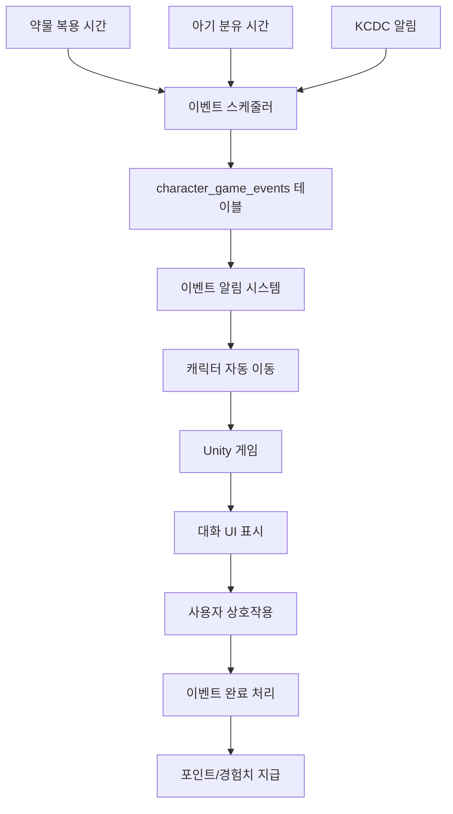

# 캐릭터창 게임화 시스템 구현 완료 문서

> **작성일**: 2025-01-26  
> **목적**: Sunrise Village 게임 스타일의 캐릭터창 게임화 시스템 구현 완료 보고

---

## 📋 구현 완료 항목

### 1. 데이터베이스 스키마 확장 ✅

**마이그레이션 파일**: `supabase/migrations/20251226113318_extend_users_for_character_game.sql`

#### 생성된 테이블:
- `character_game_events`: 게임 이벤트 저장
- `baby_feeding_schedules`: 아기 분유 스케줄 관리
- `character_positions`: 캐릭터 위치 및 활동 상태
- `character_game_interactions`: 게임 상호작용 기록

#### 확장된 테이블:
- `users.game_settings`: 게임 설정 JSONB 필드 추가

### 2. 타입 정의 ✅

**파일**: `types/game/character-game-events.ts`

- `CharacterGameEvent`: 게임 이벤트 타입
- `BabyFeedingSchedule`: 아기 분유 스케줄 타입
- `CharacterPositionData`: 캐릭터 위치 타입
- `CharacterGameInteraction`: 게임 상호작용 타입
- 각종 이벤트 데이터 타입 (MedicationEventData, BabyFeedingEventData 등)

### 3. 게임 이벤트 시스템 ✅

#### 이벤트 스케줄러
- `lib/game/character-game-event-scheduler.ts`
  - 약물 복용 이벤트 자동 생성
  - 아기 분유 이벤트 자동 생성
  - 활성 이벤트 조회

#### 이벤트 매니저
- `lib/game/character-game-event-manager.ts`
  - 이벤트 활성화/완료 처리
  - 포인트 및 경험치 계산 및 지급
  - 게임 상호작용 기록

#### 아기 분유 스케줄러
- `lib/game/baby-feeding-scheduler.ts`
  - 분유 스케줄 생성/수정
  - 다음 분유 시간 자동 계산
  - 분유 완료 처리

### 4. Unity WebGL 게임 통합 ✅

#### Unity-React 브릿지
- `lib/game/character-game-bridge.ts`
  - Unity ↔ React 양방향 통신
  - 캐릭터 이동, 대화, 이벤트 트리거 명령

#### Unity 게임 로더
- `components/game/character-game-loader.tsx`
  - Unity WebGL 게임 로드 및 초기화
  - 로딩 상태 표시

### 5. 캐릭터 자동 이동 시스템 ✅

- `lib/game/character-auto-walk.ts`
  - 이벤트 발생 시 캐릭터가 플레이어 위치로 자동 이동
  - 캐릭터 위치 업데이트 및 조회

### 6. 대화 시스템 ✅

#### 대화 UI
- `components/game/character-dialogue-ui.tsx`
  - 캐릭터 대화 말풍선 표시
  - 이벤트 완료 버튼

#### 대화 메시지 생성
- `lib/game/character-dialogue.ts`
  - 이벤트 타입별 대화 메시지 생성

### 7. API 엔드포인트 ✅

- `app/api/game/events/route.ts`: 게임 이벤트 조회/생성
- `app/api/game/events/[id]/complete/route.ts`: 이벤트 완료 처리
- `app/api/game/baby-feeding/route.ts`: 아기 분유 스케줄 관리

### 8. Server Actions ✅

- `actions/game/character-game-events.ts`: 게임 이벤트 관련 Server Actions
- `actions/game/baby-feeding.ts`: 아기 분유 스케줄 관련 Server Actions

### 9. 이벤트 스케줄링 자동화 ✅

- `lib/game/character-game-event-scheduler-auto.ts`: 자동 스케줄링 로직
- `app/api/cron/schedule-game-events/route.ts`: 크론 잡 엔드포인트

### 10. 질병청 API 연동 ✅

- `lib/game/kcdc-event-generator.ts`: KCDC 데이터를 게임 이벤트로 변환
- `app/api/cron/generate-kcdc-game-events/route.ts`: KCDC 게임 이벤트 생성 크론 잡

### 11. 이벤트 알림 시스템 ✅

- `components/game/character-game-event-notification.tsx`: 실시간 이벤트 알림
- `components/game/character-game-view.tsx`: 게임 뷰 통합 컴포넌트

### 12. 캐릭터창 페이지 통합 ✅

- `app/(dashboard)/health/family/[memberId]/character/character-page-client.tsx`
  - "게임" 탭 추가
  - Unity 게임과 이벤트 시스템 통합

---

## 🎮 주요 기능

### 1. 약물 복용 이벤트
- 약물 복용 시간에 자동으로 게임 이벤트 생성
- 캐릭터가 플레이어에게 이동하여 "약 먹을 시간이야. 약 줘!" 대화
- 약을 주면 포인트 및 경험치 획득

### 2. 아기 분유 이벤트
- 사용자가 설정한 시간 간격마다 분유 이벤트 생성
- 아기가 울어서 분유를 요청하는 이벤트
- 분유를 주면 포인트 및 경험치 획득

### 3. 자동 이동 시스템
- 이벤트 발생 시 캐릭터가 자동으로 플레이어 위치로 이동
- Unity 게임 월드에서 캐릭터 위치 추적

### 4. 실시간 이벤트 알림
- 30초마다 활성 이벤트 확인
- 우선순위가 높은 이벤트부터 표시
- 대화 UI로 상호작용

### 5. 포인트 및 경험치 시스템
- 이벤트 완료 시 포인트 및 경험치 획득
- 이벤트 타입 및 우선순위에 따라 차등 지급
- 기존 게임화 시스템과 통합

### 6. 질병청 API 연동
- KCDC 알림 데이터를 게임 이벤트로 변환
- 독감 유행, 예방접종, 질병 발생 알림 제공

---

## 📁 파일 구조

```
types/game/
├── character-game-events.ts
└── index.ts

lib/game/
├── character-game-event-scheduler.ts
├── character-game-event-scheduler-auto.ts
├── character-game-event-manager.ts
├── baby-feeding-scheduler.ts
├── character-game-bridge.ts
├── character-auto-walk.ts
├── character-dialogue.ts
├── kcdc-event-generator.ts
└── character-game-state.ts

components/game/
├── character-game-loader.tsx
├── character-dialogue-ui.tsx
├── character-game-view.tsx
└── character-game-event-notification.tsx

actions/game/
├── character-game-events.ts
└── baby-feeding.ts

app/api/game/
├── events/
│   ├── route.ts
│   └── [id]/complete/route.ts
└── baby-feeding/route.ts

app/api/cron/
├── schedule-game-events/route.ts
└── generate-kcdc-game-events/route.ts

supabase/migrations/
└── 20251226113318_extend_users_for_character_game.sql
```

---

## 🔄 데이터 흐름



---

## 🚀 사용 방법

### 1. 약물 복용 이벤트 스케줄링

```typescript
import { scheduleMedicationGameEvents } from "@/actions/game/character-game-events";

// 본인 약물 이벤트 생성
await scheduleMedicationGameEvents();

// 가족 구성원 약물 이벤트 생성
await scheduleMedicationGameEvents(familyMemberId);
```

### 2. 아기 분유 스케줄 설정

```typescript
import { upsertBabyFeedingScheduleAction } from "@/actions/game/baby-feeding";

await upsertBabyFeedingScheduleAction({
  family_member_id: "baby-id",
  feeding_interval_hours: 3.0, // 3시간마다
  reminder_enabled: true,
});
```

### 3. 활성 이벤트 조회

```typescript
import { getActiveGameEvents } from "@/actions/game/character-game-events";

const events = await getActiveGameEvents(familyMemberId);
```

### 4. 이벤트 완료 처리

```typescript
import { completeGameEventAction } from "@/actions/game/character-game-events";

const result = await completeGameEventAction(eventId);
console.log("포인트:", result.points_earned);
console.log("경험치:", result.experience_earned);
```

---

## ⚙️ 크론 잡 설정

### Vercel Cron Jobs 설정

`vercel.json` 파일에 다음을 추가:

```json
{
  "crons": [
    {
      "path": "/api/cron/schedule-game-events",
      "schedule": "0 * * * *"
    },
    {
      "path": "/api/cron/generate-kcdc-game-events",
      "schedule": "0 9 * * *"
    }
  ]
}
```

### 환경 변수

`.env` 파일에 다음 추가:

```env
CRON_SECRET=your-secret-key-here
```

---

## 🎯 다음 단계 (선택사항)

1. **Unity 게임 빌드**
   - Unity 프로젝트에서 캐릭터창 게임 씬 생성
   - 집과 마당 배경 구현
   - 가족 구성원 캐릭터 프리팹 생성
   - Unity WebGL로 빌드

2. **애니메이션 및 효과**
   - 캐릭터 걷기, 대기, 상호작용 애니메이션
   - 포인트 획득 시 파티클 효과
   - 레벨업 시 특수 효과

3. **추가 이벤트 타입**
   - 건강검진 이벤트
   - 예방접종 이벤트
   - 생애주기 이벤트

4. **게임 설정 UI**
   - 게임 활성화/비활성화
   - 사운드 설정
   - 알림 설정

---

## 📝 참고 자료

- [게임 분석 문서](.cursor/game-analysis.md): Sunrise Village 게임 분석
- [게임 구현 가이드](.cursor/game-implementation-guide.md): Unity WebGL 통합 가이드
- [구현 계획](.cursor/plans/캐릭터창_게임화_시스템_구현_17449edc.plan.md): 상세 구현 계획

---

**구현 완료일**: 2025-01-26  
**상태**: ✅ 모든 기본 기능 구현 완료

