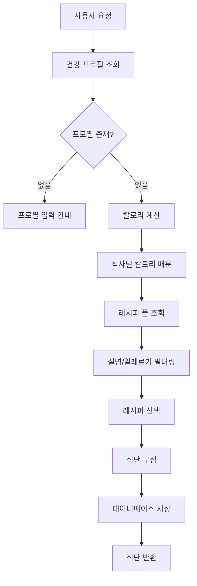
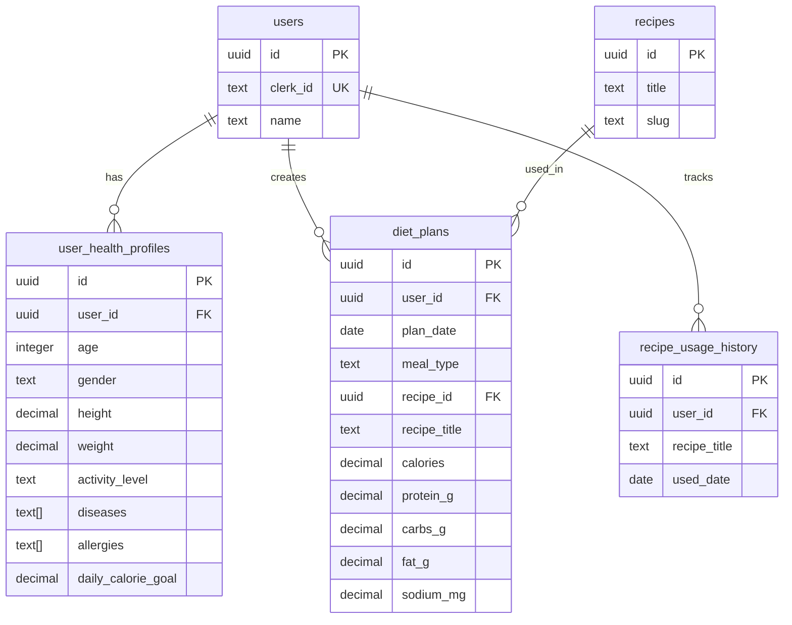

# 건강식단 MVP 문서

> **작성일**: 2025-01-XX  
> **버전**: 1.0  
> **상태**: MVP 정의 완료

---

## 목차

1. [MVP 개요](#1-mvp-개요)
2. [기능 명세](#2-기능-명세)
3. [데이터베이스 스키마](#3-데이터베이스-스키마)
4. [API 명세](#4-api-명세)
5. [UI/UX 설계](#5-uiux-설계)
6. [기술 스택](#6-기술-스택)
7. [제한 사항](#7-제한-사항-mvp)
8. [성공 지표](#8-성공-지표)
9. [향후 확장 계획](#9-향후-확장-계획)
10. [구현 체크리스트](#10-구현-체크리스트)

---

## 1. MVP 개요

### 1.1 목적

건강식단 기능의 최소 기능 제품(MVP)을 정의하여 핵심 가치를 빠르게 검증하고 사용자 피드백을 수집합니다.

### 1.2 핵심 가치 제안

- **개인 맞춤 식단**: 사용자의 건강 정보를 기반으로 하루 식단을 자동 생성
- **건강 고려**: 질병 및 알레르기를 고려한 안전한 식단 제공
- **간편한 사용**: 복잡한 설정 없이 바로 사용 가능

### 1.3 MVP 범위

#### 포함 기능

- ✅ 개인 식단 생성 (하루 단위)
- ✅ 기본 건강 정보 입력
- ✅ 칼로리 계산 (Harris-Benedict 공식)
- ✅ 질병/알레르기 필터링
- ✅ 하루 식단 표시 (아침/점심/저녁/간식)

#### 제외 기능

- ❌ 가족 식단 기능
- ❌ 주간 식단 관리
- ❌ 식사 기록 및 분석
- ❌ 제철 과일 추천 (기본 간식만 제공)
- ❌ 프리미엄 기능 (모든 사용자 무료 이용)
- ❌ 밀키트 기능
- ❌ 식단 시각화

---

## 2. 기능 명세

### 2.1 건강 프로필 입력

**목적**: 식단 생성에 필요한 최소한의 건강 정보를 수집합니다.

#### 필수 입력 항목

- **나이** (number): 만 나이
- **성별** (male | female)
- **키** (cm, number): 센티미터 단위
- **몸무게** (kg, number): 킬로그램 단위
- **활동 수준** (sedentary | lightly_active | moderately_active | very_active)

#### 선택 입력 항목

- **질병 목록** (string[]): 예: `["diabetes", "hypertension"]`
- **알레르기 목록** (string[]): 예: `["peanuts", "shellfish"]`

#### 데이터 저장

- `user_health_profiles` 테이블에 저장
- 칼로리 목표 자동 계산 (Harris-Benedict 공식)

#### 관련 파일

- `app/api/health/profile/route.ts` - 건강 프로필 API
- `app/health/profile/page.tsx` - 건강 프로필 입력 페이지
- `lib/diet/calorie-calculator.ts` - 칼로리 계산 로직

### 2.2 하루 식단 생성

**목적**: 사용자의 건강 정보를 기반으로 하루 식단을 자동 생성합니다.

#### 생성 로직

1. **건강 프로필 조회**: 사용자의 건강 정보 가져오기
2. **일일 칼로리 목표 계산**: Harris-Benedict 공식 또는 한국영양학회 권장 칼로리
3. **식사별 칼로리 배분**:
   - 아침: 30%
   - 점심: 35%
   - 저녁: 30%
   - 간식: 5%
4. **한식 구조 생성**:
   - 밥 (35%)
   - 반찬 3개 (각 15%, 총 45%)
   - 국/찌개 (20%)
5. **질병/알레르기 필터링 적용**: 부적합한 음식 제외
6. **레시피 선택 및 조합**: 필터링된 레시피 풀에서 선택

#### 데이터 흐름



#### API 엔드포인트

- `POST /api/diet/personal`
  - Body: `{ targetDate: "YYYY-MM-DD" }`
  - Response: `{ dietPlan: DailyDietPlan }`

#### 관련 파일

- `app/api/diet/personal/route.ts` - 식단 생성 API
- `lib/diet/personal-diet-generator.ts` - 식단 생성 로직
- `lib/diet/food-filtering.ts` - 질병/알레르기 필터링

### 2.3 식단 표시

**목적**: 생성된 식단을 사용자에게 명확하게 표시합니다.

#### 표시 항목

- 날짜 선택기
- 아침/점심/저녁/간식 카드
- 각 식사의 구성 (밥, 반찬, 국)
- 총 영양 정보 (칼로리, 단백질, 탄수화물, 지방)

#### UI 컴포넌트

- `components/diet/daily-diet-view.tsx` - 하루 식단 뷰
- `components/diet/meal-composition-card.tsx` - 식사 구성 카드
- `components/diet/meal-card.tsx` - 간식 카드

#### 페이지

- `app/diet/page.tsx` - 식단 관리 페이지

### 2.4 칼로리 계산

**목적**: 사용자의 일일 권장 칼로리를 정확하게 계산합니다.

#### 계산 공식

- **12세 이상**: Harris-Benedict 공식
  - 남성: BMR = 88.362 + (13.397 × 체중) + (4.799 × 키) - (5.677 × 나이)
  - 여성: BMR = 447.593 + (9.247 × 체중) + (3.098 × 키) - (4.330 × 나이)
  - 일일 칼로리 = BMR × 활동 계수
- **18세 미만**: 한국영양학회 권장 칼로리

#### 조정 요소

- 질병별 칼로리 조정 계수
- 활동 수준별 계수 (sedentary: 1.2, lightly_active: 1.375, moderately_active: 1.55, very_active: 1.725)

#### 관련 파일

- `lib/diet/calorie-calculator.ts` - 칼로리 계산 로직

### 2.5 질병/알레르기 필터링

**목적**: 사용자의 질병 및 알레르기를 고려하여 부적합한 음식을 제외합니다.

#### 필터링 로직

1. **질병별 제외 음식 조회**: 186개 질병 데이터에서 제외 음식 목록 가져오기
2. **레시피 재료 및 키워드 검사**: 레시피 재료와 제목에서 제외 음식 확인
3. **알레르기 성분 확인**: 알레르기 유발 성분 포함 여부 확인
4. **나트륨 제한 확인**: 고혈압, 신장질환 시 나트륨 제한

#### 필터링 예시

```typescript
// 당뇨병 환자
제외: 설탕, 꿀, 단맛이 강한 과일 등

// 고혈압 환자
제외: 나트륨 함량이 높은 음식 (장류, 젓갈 등)

// 알레르기 (견과류)
제외: 땅콩, 아몬드, 호두 등이 포함된 레시피
```

#### 관련 파일

- `lib/diet/food-filtering.ts` - 필터링 로직
- `supabase/migrations/` - 질병별 제외 음식 데이터

---

## 3. 데이터베이스 스키마

### 3.1 필수 테이블

#### user_health_profiles

사용자 건강 프로필 정보를 저장합니다.

**필수 필드**:
- `user_id` (UUID): 사용자 ID (외래 키)
- `age` (INTEGER): 나이
- `gender` (TEXT): 성별 (male | female)
- `height` (DECIMAL): 키 (cm)
- `weight` (DECIMAL): 몸무게 (kg)
- `activity_level` (TEXT): 활동 수준

**선택 필드**:
- `diseases` (TEXT[]): 질병 목록
- `allergies` (TEXT[]): 알레르기 목록
- `daily_calorie_goal` (DECIMAL): 일일 칼로리 목표 (자동 계산)

**관계**:
- `user_id` → `users.id` (외래 키)

#### diet_plans

생성된 식단 정보를 저장합니다.

**필수 필드**:
- `user_id` (UUID): 사용자 ID (외래 키)
- `plan_date` (DATE): 식단 날짜 (YYYY-MM-DD)
- `meal_type` (TEXT): 식사 타입 (breakfast | lunch | dinner | snack)
- `recipe_title` (TEXT): 레시피 제목

**영양 정보**:
- `calories` (DECIMAL): 칼로리
- `protein_g` (DECIMAL): 단백질 (g)
- `carbs_g` (DECIMAL): 탄수화물 (g)
- `fat_g` (DECIMAL): 지방 (g)
- `sodium_mg` (DECIMAL): 나트륨 (mg)

**선택 필드**:
- `recipe_id` (UUID): 레시피 ID (외래 키, nullable)
- `ingredients` (JSONB): 재료 목록
- `instructions` (TEXT): 조리법

**관계**:
- `user_id` → `users.id` (외래 키)
- `recipe_id` → `recipes.id` (외래 키, nullable)

#### recipe_usage_history

레시피 사용 이력을 저장합니다 (30일 중복 방지용).

**필수 필드**:
- `user_id` (UUID): 사용자 ID (외래 키)
- `recipe_title` (TEXT): 레시피 제목
- `used_date` (DATE): 사용 날짜

**관계**:
- `user_id` → `users.id` (외래 키)

### 3.2 제외되는 테이블 (MVP 범위 외)

- `family_members` - 가족 기능 제외
- `weekly_diet_plans` - 주간 식단 제외
- `meal_photos` - 식사 기록 제외
- `user_subscriptions` - 프리미엄 기능 제외

### 3.3 데이터베이스 관계도



---

## 4. API 명세

### 4.1 건강 프로필 관리

#### GET /api/health/profile

현재 사용자의 건강 프로필을 조회합니다.

**인증**: 필수 (Clerk)

**Response**:
```json
{
  "profile": {
    "id": "uuid",
    "user_id": "uuid",
    "age": 30,
    "gender": "male",
    "height": 175,
    "weight": 70,
    "activity_level": "moderately_active",
    "diseases": ["diabetes"],
    "allergies": ["peanuts"],
    "daily_calorie_goal": 2200
  } | null
}
```

**에러 응답**:
- `401 Unauthorized`: 인증되지 않은 사용자
- `500 Internal Server Error`: 서버 오류

#### POST /api/health/profile

건강 프로필을 생성하거나 업데이트합니다.

**인증**: 필수 (Clerk)

**Request Body**:
```json
{
  "age": 30,
  "gender": "male",
  "height": 175,
  "weight": 70,
  "activity_level": "moderately_active",
  "diseases": ["diabetes"],
  "allergies": ["peanuts"]
}
```

**Response**:
```json
{
  "profile": {
    "id": "uuid",
    "user_id": "uuid",
    "age": 30,
    "gender": "male",
    "height": 175,
    "weight": 70,
    "activity_level": "moderately_active",
    "diseases": ["diabetes"],
    "allergies": ["peanuts"],
    "daily_calorie_goal": 2200
  }
}
```

**에러 응답**:
- `400 Bad Request`: 잘못된 입력 데이터
- `401 Unauthorized`: 인증되지 않은 사용자
- `500 Internal Server Error`: 서버 오류

### 4.2 식단 생성

#### POST /api/diet/personal

개인 식단을 생성하고 저장합니다.

**인증**: 필수 (Clerk)

**Request Body**:
```json
{
  "targetDate": "2025-01-15"
}
```

**Response**:
```json
{
  "dietPlan": {
    "date": "2025-01-15",
    "breakfast": {
      "rice": { "id": "uuid", "title": "현미밥", ... },
      "sides": [
        { "id": "uuid", "title": "된장찌개", ... },
        { "id": "uuid", "title": "시금치나물", ... },
        { "id": "uuid", "title": "계란찜", ... }
      ],
      "soup": { "id": "uuid", "title": "미역국", ... }
    },
    "lunch": { ... },
    "dinner": { ... },
    "snack": { "id": "uuid", "title": "사과", ... },
    "totalNutrition": {
      "calories": 2200,
      "protein": 120,
      "carbs": 300,
      "fat": 60
    }
  },
  "calorieWarning": null
}
```

**에러 응답**:
- `401 Unauthorized`: 인증되지 않은 사용자
- `404 Not Found`: 건강 프로필이 없음
- `500 Internal Server Error`: 서버 오류

#### GET /api/diet/personal?date=YYYY-MM-DD

저장된 식단을 조회합니다.

**인증**: 필수 (Clerk)

**Query Parameters**:
- `date` (required): 식단 날짜 (YYYY-MM-DD)

**Response**:
```json
{
  "dietPlan": {
    "date": "2025-01-15",
    "breakfast": { ... },
    "lunch": { ... },
    "dinner": { ... },
    "snack": { ... },
    "totalNutrition": { ... }
  } | null
}
```

**에러 응답**:
- `401 Unauthorized`: 인증되지 않은 사용자
- `400 Bad Request`: 잘못된 날짜 형식
- `500 Internal Server Error`: 서버 오류

---

## 5. UI/UX 설계

### 5.1 페이지 구조

#### 식단 관리 페이지 (`/diet`)

**레이아웃**:
```
┌─────────────────────────────────────┐
│  건강 맞춤 식단                      │
├─────────────────────────────────────┤
│  [날짜 선택기]  [식단 생성 버튼]     │
├─────────────────────────────────────┤
│  오늘의 총 영양 정보                 │
│  칼로리 | 단백질 | 탄수화물 | 지방   │
├─────────────────────────────────────┤
│  🌅 아침                            │
│  [밥] [반찬1] [반찬2] [반찬3] [국]   │
├─────────────────────────────────────┤
│  ☀️ 점심                            │
│  [밥] [반찬1] [반찬2] [반찬3] [국]   │
├─────────────────────────────────────┤
│  🌙 저녁                            │
│  [밥] [반찬1] [반찬2] [반찬3] [국]   │
├─────────────────────────────────────┤
│  🍎 간식                            │
│  [간식 레시피]                      │
└─────────────────────────────────────┘
```

**주요 요소**:
- 헤더: "건강 맞춤 식단"
- 날짜 선택기: 달력 또는 날짜 입력 필드
- 식단 생성 버튼: "오늘 식단 생성" 또는 "선택한 날짜 식단 생성"
- 하루 식단 표시 영역: 아침/점심/저녁/간식 카드

#### 건강 프로필 페이지 (`/health/profile`)

**레이아웃**:
```
┌─────────────────────────────────────┐
│  건강 프로필 입력                    │
├─────────────────────────────────────┤
│  나이:        [____]                │
│  성별:        [남성] [여성]         │
│  키:          [____] cm             │
│  몸무게:      [____] kg             │
│  활동 수준:   [선택...]             │
│                                     │
│  질병 (선택): [추가]                │
│  알레르기 (선택): [추가]            │
│                                     │
│  [저장하기]                         │
└─────────────────────────────────────┘
```

**주요 요소**:
- 건강 정보 입력 폼
- 저장 버튼
- 저장 후 식단 생성 페이지로 이동 안내

### 5.2 사용자 플로우

```mermaid
flowchart TD
    A[앱 시작] --> B{건강 프로필<br/>있음?}
    B -->|없음| C[/health/profile<br/>건강 프로필 입력]
    B -->|있음| D[/diet<br/>식단 관리 페이지]
    C --> E[프로필 저장]
    E --> D
    D --> F{식단 생성<br/>요청}
    F --> G[식단 생성 API 호출]
    G --> H{생성<br/>성공?}
    H -->|실패| I[에러 메시지 표시]
    I --> F
    H -->|성공| J[식단 표시]
    J --> K[식단 확인]
    K --> L{다른 날짜<br/>생성?}
    L -->|예| F
    L -->|아니오| M[종료]
```

### 5.3 에러 처리

#### 건강 프로필 없음

**상황**: 식단 생성 시 건강 프로필이 없는 경우

**처리**:
1. 에러 메시지 표시: "건강 프로필을 먼저 입력해주세요"
2. 건강 프로필 입력 페이지로 이동 버튼 제공
3. 자동 리다이렉트 (선택적)

#### 식단 생성 실패

**상황**: 레시피 부족 또는 필터링 결과 없음

**처리**:
1. 에러 메시지 표시: "식단 생성에 실패했습니다. 다시 시도해주세요"
2. 재시도 버튼 제공
3. 기본 레시피로 대체 (가능한 경우)

#### 레시피 부족

**상황**: 필터링 후 사용 가능한 레시피가 부족한 경우

**처리**:
1. 경고 메시지 표시: "사용 가능한 레시피가 부족합니다"
2. 기본 레시피로 대체
3. 필터 조건 완화 제안 (선택적)

---

## 6. 기술 스택

### 6.1 프론트엔드

- **Next.js 15**: App Router 사용
- **React 19**: 최신 React 기능 활용
- **TypeScript**: 타입 안정성 보장
- **Tailwind CSS v4**: 스타일링

### 6.2 백엔드

- **Next.js API Routes**: 서버 사이드 API
- **Supabase (PostgreSQL)**: 데이터베이스

### 6.3 인증

- **Clerk**: 사용자 인증 및 관리

### 6.4 외부 서비스

- **Edamam Recipe Search API**: 레시피 검색 (선택적)
- **Fallback Recipes**: 기본 한식 레시피 100+개

---

## 7. 제한 사항 (MVP)

### 7.1 기능 제한

- **가족 식단 기능 없음**: 개인 식단만 제공
- **주간 식단 관리 없음**: 하루 단위 식단만 제공
- **식사 기록 및 분석 없음**: 식단 생성 및 표시만 제공
- **제철 과일 추천 없음**: 기본 간식만 제공
- **프리미엄 기능 없음**: 모든 사용자 무료 이용
- **밀키트 기능 없음**: 레시피 기반 식단만 제공
- **식단 시각화 없음**: 텍스트 및 카드 형태로만 표시

### 7.2 성능 고려사항

- **레시피 풀**: 기본 레시피 100개 + 외부 API (Edamam)
- **중복 방지**: 30일 이내 레시피 중복 방지
- **캐싱**: 식단 생성 결과 캐싱 (선택적)

### 7.3 데이터 제한

- **질병 데이터**: 186개 질병별 제외 음식 데이터
- **레시피 데이터**: 기본 한식 레시피 100+개
- **사용 이력**: 30일 이내 레시피 사용 이력 저장

---

## 8. 성공 지표

### 8.1 핵심 지표

- **건강 프로필 입력 완료율**: 전체 사용자 중 건강 프로필을 입력한 비율
- **식단 생성 성공률**: 식단 생성 요청 중 성공한 비율
- **일일 활성 사용자 수**: 하루에 식단을 생성하거나 조회한 사용자 수
- **사용자 만족도**: 사용자 피드백 및 평점

### 8.2 측정 방법

- **Google Analytics**: 사용자 행동 추적
- **사용자 피드백 수집**: 설문조사 또는 인앱 피드백
- **A/B 테스트**: UI/UX 개선 (선택적)

### 8.3 목표 값 (예시)

- 건강 프로필 입력 완료율: 70% 이상
- 식단 생성 성공률: 90% 이상
- 일일 활성 사용자 수: 100명 이상 (베타 테스트)
- 사용자 만족도: 4.0/5.0 이상

---

## 9. 향후 확장 계획

### 9.1 Phase 2 (MVP 이후)

- **주간 식단 관리**: 7일간 식단 생성 및 관리
- **가족 식단 기능**: 가족 구성원별 식단 생성
- **식사 기록 및 분석**: 실제 섭취 식단 기록 및 분석
- **제철 과일 추천**: 계절별 제철 과일 추천

### 9.2 Phase 3

- **프리미엄 기능**: 고급 기능 및 분석 도구
- **밀키트 연동**: 밀키트 주문 및 배송 연동
- **식단 시각화**: 영양소 차트 및 그래프
- **AI 기반 식단 최적화**: 머신러닝을 활용한 식단 개선

### 9.3 Phase 4

- **소셜 기능**: 식단 공유 및 커뮤니티
- **레시피 추천**: 사용자 취향 기반 레시피 추천
- **영양사 상담**: 전문가 상담 서비스 연동

---

## 10. 구현 체크리스트

### 10.1 데이터베이스

- [ ] `user_health_profiles` 테이블 생성
- [ ] `diet_plans` 테이블 생성
- [ ] `recipe_usage_history` 테이블 생성
- [ ] 질병별 제외 음식 데이터 입력 (186개 질병)
- [ ] 기본 레시피 데이터 입력 (100+개)

### 10.2 API

- [ ] 건강 프로필 조회 API (`GET /api/health/profile`)
- [ ] 건강 프로필 생성/업데이트 API (`POST /api/health/profile`)
- [ ] 식단 생성 API (`POST /api/diet/personal`)
- [ ] 식단 조회 API (`GET /api/diet/personal`)

### 10.3 UI

- [ ] 건강 프로필 입력 페이지 (`/health/profile`)
- [ ] 식단 관리 페이지 (`/diet`)
- [ ] 식단 표시 컴포넌트 (`DailyDietView`)
- [ ] 식사 구성 카드 컴포넌트 (`MealCompositionCard`)
- [ ] 간식 카드 컴포넌트 (`MealCard`)

### 10.4 로직

- [ ] 칼로리 계산 로직 (`calorie-calculator.ts`)
- [ ] 식단 생성 로직 (`personal-diet-generator.ts`)
- [ ] 필터링 로직 (`food-filtering.ts`)
- [ ] 레시피 사용 이력 관리 (`recipe-history.ts`)

### 10.5 테스트

- [ ] 단위 테스트 (칼로리 계산, 필터링 등)
- [ ] 통합 테스트 (API 엔드포인트)
- [ ] 사용자 테스트 (베타 테스트)

---

## 11. 참고 문서

- [AI-DIET-IMPLEMENTATION.md](./AI-DIET-IMPLEMENTATION.md) - 전체 구현 가이드
- [diet-generation-flow.md](./diet-generation-flow.md) - 식단 생성 흐름 상세 설명
- [calorie-calculator.ts](../lib/diet/calorie-calculator.ts) - 칼로리 계산 로직
- [personal-diet-generator.ts](../lib/diet/personal-diet-generator.ts) - 식단 생성 로직
- [food-filtering.ts](../lib/diet/food-filtering.ts) - 필터링 로직

---

## 12. 용어 정의

- **MVP**: Minimum Viable Product (최소 기능 제품)
- **BMR**: Basal Metabolic Rate (기초대사량)
- **Harris-Benedict 공식**: 기초대사량을 계산하는 공식
- **한식 구조**: 밥 + 반찬 3개 + 국/찌개 형태의 식사 구성
- **식사별 칼로리 배분**: 하루 칼로리를 아침/점심/저녁/간식으로 나누는 비율

---

**문서 버전**: 1.0  
**최종 업데이트**: 2025-01-XX  
**작성자**: 개발팀

