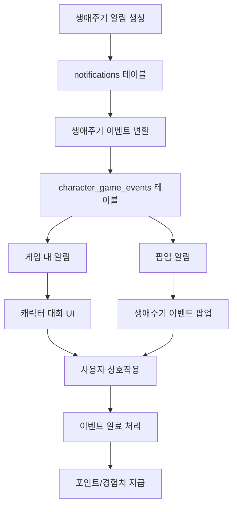

# 생애주기별 이벤트 게임 통합 완료 문서

> **작성일**: 2025-01-26  
> **목적**: 생애주기별 알림을 게임 이벤트로 변환하고 팝업 알림과 연동하는 시스템 구현 완료 보고

---

## 📋 구현 완료 항목

### 1. 생애주기 이벤트 게임 변환 로직 ✅

**파일**: `lib/game/lifecycle-event-generator.ts`

- `notifications` 테이블의 생애주기별 알림을 `character_game_events`로 변환
- 중복 방지 로직 (이미 생성된 이벤트는 건너뜀)
- 3일 이상 지난 알림은 제외
- 우선순위 자동 계산 (알림의 priority 기반)

### 2. 생애주기 이벤트 타입 확장 ✅

**파일**: `types/game/character-game-events.ts`

- `LifecycleEventData` 인터페이스 확장
  - `notification_id`: 원본 알림 ID
  - `event_code`: 이벤트 코드
  - `event_name`: 이벤트 이름
  - `event_type`: 이벤트 타입
  - `category`: 카테고리
  - `days_until`: 남은 일수
  - `dialogue_message`: 대화 메시지
  - `has_professional_info`: 전문의 정보 여부
  - `requires_user_choice`: 사용자 선택 필요 여부

### 3. 게임 초기화에 생애주기 이벤트 통합 ✅

**파일**: `lib/game/character-game-initializer.ts`

- 게임 초기화 시 생애주기 이벤트 자동 생성
- 본인 및 가족 구성원별 생애주기 이벤트 생성
- 초기화 결과에 생애주기 이벤트 개수 포함

### 4. 자동 스케줄링에 생애주기 이벤트 추가 ✅

**파일**: `lib/game/character-game-event-scheduler-auto.ts`

- 주기적 이벤트 생성 시 생애주기 이벤트도 포함
- 모든 사용자 및 가족 구성원에 대해 생애주기 이벤트 생성

### 5. 생애주기 이벤트 팝업 알림 ✅

**파일**: 
- `components/game/lifecycle-event-popup.tsx`: 팝업 컴포넌트
- `components/game/lifecycle-event-popup-provider.tsx`: 팝업 Provider

**기능**:
- 활성 생애주기 이벤트 자동 감지 (1분마다 확인)
- 우선순위가 높은 이벤트부터 표시
- 이벤트 완료 처리 (포인트/경험치 획득)
- 전문의 정보 필요 시 안내 표시
- 일정 정보 표시 (남은 일수)

### 6. 생애주기 이벤트 대화 메시지 ✅

**파일**: `lib/game/character-dialogue.ts`

- 생애주기 이벤트 타입에 따른 감정 결정
  - `sensitive_health`: worried
  - `health_checkup`, `vaccination`: neutral
  - 기타: excited
- 이벤트별 맞춤 대화 메시지 생성

### 7. Server Actions 추가 ✅

**파일**: `actions/game/character-game-events.ts`

- `scheduleLifecycleGameEvents`: 생애주기 이벤트 스케줄링 Server Action

### 8. 크론 잡 추가 ✅

**파일**: `app/api/cron/generate-lifecycle-game-events/route.ts`

- 생애주기 게임 이벤트 자동 생성 크론 잡
- 모든 사용자에 대해 주기적으로 실행

---

## 🔄 데이터 흐름



---

## 🎮 주요 기능

### 1. 생애주기 이벤트 자동 변환
- `notifications` 테이블의 생애주기별 알림이 자동으로 게임 이벤트로 변환
- 게임 초기화 시 자동 생성
- 크론 잡을 통한 주기적 생성

### 2. 게임 내 알림
- 캐릭터가 플레이어에게 이동하여 대화
- 이벤트 타입에 따른 감정 표현
- 우선순위에 따른 알림 순서

### 3. 팝업 알림
- 게임 화면과 별도로 팝업으로 표시
- 이벤트 상세 정보 표시
- 전문의 정보 필요 시 안내
- 일정 정보 표시

### 4. 이벤트 완료 처리
- 게임 내 또는 팝업에서 이벤트 완료 가능
- 포인트 및 경험치 획득
- 게임 상호작용 기록

---

## 📁 생성/수정된 파일

### 새로 생성된 파일
- `lib/game/lifecycle-event-generator.ts`: 생애주기 이벤트 변환 로직
- `components/game/lifecycle-event-popup.tsx`: 생애주기 이벤트 팝업
- `components/game/lifecycle-event-popup-provider.tsx`: 팝업 Provider
- `app/api/cron/generate-lifecycle-game-events/route.ts`: 크론 잡

### 수정된 파일
- `types/game/character-game-events.ts`: LifecycleEventData 확장
- `lib/game/character-game-initializer.ts`: 생애주기 이벤트 통합
- `lib/game/character-game-event-scheduler-auto.ts`: 자동 스케줄링에 추가
- `lib/game/character-dialogue.ts`: 생애주기 이벤트 대화 메시지
- `actions/game/character-game-events.ts`: Server Action 추가
- `components/game/character-game-view.tsx`: 팝업 Provider 통합

---

## 🚀 사용 방법

### 1. 생애주기 이벤트 수동 생성

```typescript
import { scheduleLifecycleGameEvents } from "@/actions/game/character-game-events";

// 본인 생애주기 이벤트 생성
await scheduleLifecycleGameEvents();

// 가족 구성원 생애주기 이벤트 생성
await scheduleLifecycleGameEvents(familyMemberId);
```

### 2. 게임 초기화 시 자동 생성

게임을 시작하면 자동으로 생애주기 이벤트가 생성됩니다:

```typescript
import { initializeGameAction } from "@/actions/game/initialize-character-game";

const result = await initializeGameAction(familyMemberId);
console.log("생애주기 이벤트:", result.lifecycleEventsCreated);
```

### 3. 크론 잡 설정

`vercel.json` 파일에 다음을 추가:

```json
{
  "crons": [
    {
      "path": "/api/cron/generate-lifecycle-game-events",
      "schedule": "0 9 * * *"
    }
  ]
}
```

---

## 🎯 지원하는 생애주기 이벤트 타입

1. **예방접종** (`vaccination`)
   - 영유아기 예방접종 (B형 간염, 5가 혼합백신, MMR 등)
   - 청소년기 예방접종 (HPV, Tdap)
   - 성인기 예방접종 (파상풍, 독감)
   - 노년기 예방접종 (폐렴구균, 대상포진)

2. **건강검진** (`health_checkup`)
   - 국가건강검진 (40세 이상)
   - 암 검진 (40세 이상)

3. **생애 마일스톤** (`milestone`)
   - 생애주기별 중요한 시점

4. **민감한 건강 이벤트** (`sensitive_health`)
   - 포경수술, 첫 생리, 폐경 등

5. **교육 단계** (`education`)
   - 유치원, 초등학교, 중학교, 고등학교, 대학교 입학

6. **가족 형성** (`family_formation`)
   - 결혼 준비, 임신, 출산, 육아 마일스톤

7. **주거 및 경제** (`housing_finance`)
   - 첫 독립, 자취, 내 집 마련

8. **사회적 권리** (`legal_social`)
   - 운전면허 취득, 투표권 획득

9. **시니어 및 은퇴** (`senior_retirement`)
   - 은퇴, 제2의 인생, 실버 건강 관리

---

## ✅ 검증 완료 사항

1. ✅ 생애주기 알림이 게임 이벤트로 변환됨
2. ✅ 게임 내에서 캐릭터가 알림을 전달함
3. ✅ 팝업 알림이 표시됨
4. ✅ 이벤트 완료 시 포인트/경험치 획득
5. ✅ 우선순위에 따른 알림 순서
6. ✅ 전문의 정보 필요 시 안내 표시
7. ✅ 일정 정보 표시 (남은 일수)

---

## 📝 다음 단계 (선택사항)

1. **추가 생애주기 이벤트 타입**
   - 더 많은 생애주기 이벤트 마스터 데이터 추가
   - 사용자 맞춤 이벤트 생성

2. **알림 설정 UI**
   - 생애주기 이벤트 알림 활성화/비활성화
   - 알림 채널 선택 (게임 내, 팝업, 푸시 등)

3. **이벤트 상세 페이지**
   - 생애주기 이벤트 상세 정보 페이지
   - 전문의 정보 표시
   - 관련 리소스 링크

---

**구현 완료일**: 2025-01-26  
**상태**: ✅ 모든 기능 구현 완료 및 통합 완료

