# 데이터베이스 ERD (Entity Relationship Diagram)

이 문서는 Supabase 데이터베이스의 전체 테이블 구조와 관계를 시각화합니다.

## 주요 엔티티 그룹

### 1. 사용자 및 인증
- `users` (중앙 허브 테이블)
- `user_health_profiles`
- `user_subscriptions`
- `user_gamification`
- `identity_verifications`
- `consent_records`

### 2. 가족 구성원 관리
- `family_members`
- `family_groups`
- `family_group_members`

### 3. 레시피 및 식단
- `recipes`
- `recipe_ingredients`
- `recipe_steps`
- `recipe_variation_groups`
- `weekly_diet_plans`
- `diet_plans`
- `weekly_nutrition_stats`
- `weekly_shopping_lists`

### 4. 건강 관리
- `health_data_sources`
- `hospital_records`
- `medication_records`
- `disease_records`
- `vital_signs`
- `weight_logs`
- `activity_logs`
- `sleep_logs`
- `user_vaccination_records`
- `user_vaccination_schedules`
- `user_health_checkup_records`

### 5. 알림 시스템
- `notifications` (통합 알림 테이블)
- `health_notifications` (DEPRECATED)
- `vaccination_notification_logs` (DEPRECATED)

### 6. 커뮤니티
- `community_groups`
- `group_members`
- `group_posts`
- `post_comments`
- `post_likes`
- `user_follows`

### 7. 게임화
- `character_levels`
- `character_skins`
- `character_positions`
- `character_game_events`
- `character_game_interactions`
- `daily_quests`
- `random_events`
- `minigame_records`

### 8. 구독 및 결제
- `subscriptions`
- `payment_transactions`
- `promo_codes`
- `promo_code_uses`

## Mermaid ERD 다이어그램

```mermaid
erDiagram
    users ||--o{ user_health_profiles : "1:1"
    users ||--o{ family_members : "1:N"
    users ||--o{ recipes : "1:N"
    users ||--o{ subscriptions : "1:N"
    users ||--o{ notifications : "1:N"
    users ||--o{ community_groups : "1:N"
    
    family_members ||--o{ diet_plans : "1:N"
    family_members ||--o{ medication_records : "1:N"
    family_members ||--o{ disease_records : "1:N"
    family_members ||--o{ user_vaccination_records : "1:N"
    family_members ||--o{ notifications : "1:N"
    
    recipes ||--o{ recipe_ingredients : "1:N"
    recipes ||--o{ recipe_steps : "1:N"
    recipes ||--o{ recipe_ratings : "1:N"
    recipes ||--o{ diet_plans : "1:N"
    recipes ||--o{ recipe_variation_groups : "1:N"
    
    weekly_diet_plans ||--o{ diet_plans : "1:N"
    weekly_diet_plans ||--o{ weekly_nutrition_stats : "1:N"
    weekly_diet_plans ||--o{ weekly_shopping_lists : "1:N"
    
    health_data_sources ||--o{ hospital_records : "1:N"
    health_data_sources ||--o{ medication_records : "1:N"
    health_data_sources ||--o{ disease_records : "1:N"
    
    hospital_records ||--o{ medication_records : "1:N"
    hospital_records ||--o{ disease_records : "1:N"
    
    allergies ||--o{ allergy_derived_ingredients : "1:N"
    allergies ||--o{ emergency_procedures : "1:N"
    
    diseases ||--o{ disease_records : "1:N"
    diseases ||--o{ disease_excluded_foods_extended : "1:N"
    
    subscriptions ||--o{ payment_transactions : "1:N"
    subscriptions ||--o{ promo_code_uses : "1:N"
    
    promo_codes ||--o{ promo_code_uses : "1:N"
    
    community_groups ||--o{ group_members : "1:N"
    community_groups ||--o{ group_posts : "1:N"
    
    group_posts ||--o{ post_comments : "1:N"
    group_posts ||--o{ post_likes : "1:N"
    post_comments ||--o{ post_comments : "self-ref"
    post_comments ||--o{ post_likes : "1:N"
    
    users ||--o{ user_follows : "follower"
    users ||--o{ user_follows : "following"
    
    character_game_events ||--o{ character_game_interactions : "1:N"
    
    user_vaccination_schedules ||--o{ vaccination_notification_logs : "1:N"
    user_vaccination_records ||--o{ vaccination_notification_logs : "1:N"
    
    user_periodic_health_services ||--o{ user_periodic_service_reminders : "1:N"
    medication_records ||--o{ medication_reminder_logs : "1:N"
    
    notifications ||--o{ lifecycle_notification_shares : "1:N"
```

## 주요 관계 설명

### 1. 사용자 중심 관계
- `users`는 모든 사용자 관련 테이블의 부모입니다.
- `users` 삭제 시 대부분의 자식 테이블은 CASCADE 삭제됩니다.
- `recipes`는 예외적으로 `user_id`가 NULL일 수 있어 사용자 삭제 후에도 유지됩니다.

### 2. 가족 구성원 관계
- `family_members`는 `users`에 종속됩니다.
- 가족 구성원 관련 건강 데이터는 `family_member_id`로 연결됩니다.
- `family_member_id`가 NULL이면 본인(`user_id`) 데이터로 간주됩니다.

### 3. 레시피 및 식단 관계
- `recipes`는 `recipe_ingredients`, `recipe_steps`와 1:N 관계입니다.
- `recipe_variation_groups`와 `recipes`는 순환 참조 관계입니다.
- `weekly_diet_plans`는 여러 `diet_plans`를 포함합니다.

### 4. 건강 데이터 관계
- `health_data_sources`는 외부 데이터 소스 연결 정보를 저장합니다.
- `hospital_records`는 `medication_records`, `disease_records`의 부모입니다.
- 건강 데이터는 `user_id` 또는 `family_member_id`로 연결됩니다.

### 5. 알림 시스템 관계
- `notifications`는 통합 알림 테이블로 모든 알림 타입을 관리합니다.
- `lifecycle_notification_shares`는 가족 구성원 간 알림 공유를 관리합니다.

### 6. 커뮤니티 관계
- `community_groups`는 여러 `group_members`와 `group_posts`를 포함합니다.
- `post_comments`는 자기 참조로 대댓글을 지원합니다.
- `user_follows`는 자기 참조로 사용자 간 팔로우 관계를 관리합니다.

## 외래 키 제약조건

모든 외래 키는 다음 원칙을 따릅니다:

1. **CASCADE 삭제**: 부모 레코드 삭제 시 자식 레코드도 함께 삭제
2. **SET NULL 삭제**: 부모 레코드 삭제 시 자식 레코드의 외래 키를 NULL로 설정 (예: `recipes.user_id`)
3. **RESTRICT 삭제**: 자식 레코드가 있으면 부모 레코드 삭제 불가

## 인덱스 및 성능 최적화

주요 인덱스는 다음 컬럼에 생성됩니다:

- `users.clerk_id` (UNIQUE)
- `users.id` (PRIMARY KEY)
- `family_members.user_id`
- `recipes.user_id`
- `recipes.slug` (UNIQUE)
- `notifications.user_id`
- `notifications.family_member_id`
- `notifications.created_at`
- `diet_plans.user_id`
- `diet_plans.plan_date`

## 데이터 무결성

1. **CHECK 제약조건**: 
   - `users.gender`: 'male', 'female', 'other'
   - `family_members.member_type`: 'human', 'pet'
   - `recipes.difficulty`: 1-5 범위
   - `recipe_ratings.rating`: 0-5 범위

2. **UNIQUE 제약조건**:
   - `users.clerk_id`
   - `users.id`
   - `recipes.slug`
   - `user_health_profiles.user_id`
   - `user_subscriptions.user_id`

3. **NOT NULL 제약조건**:
   - 대부분의 PRIMARY KEY와 외래 키
   - 필수 비즈니스 필드 (이름, 날짜 등)

